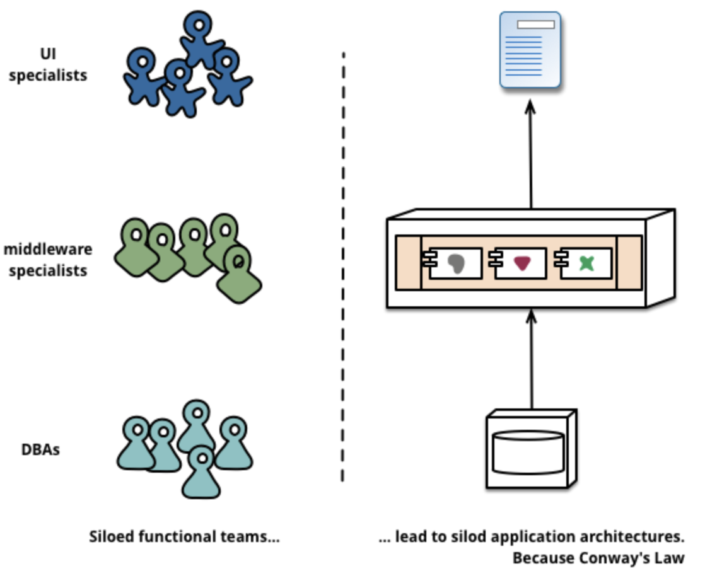
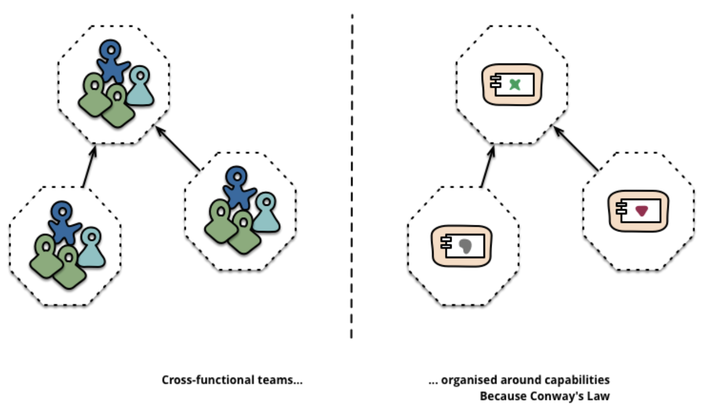
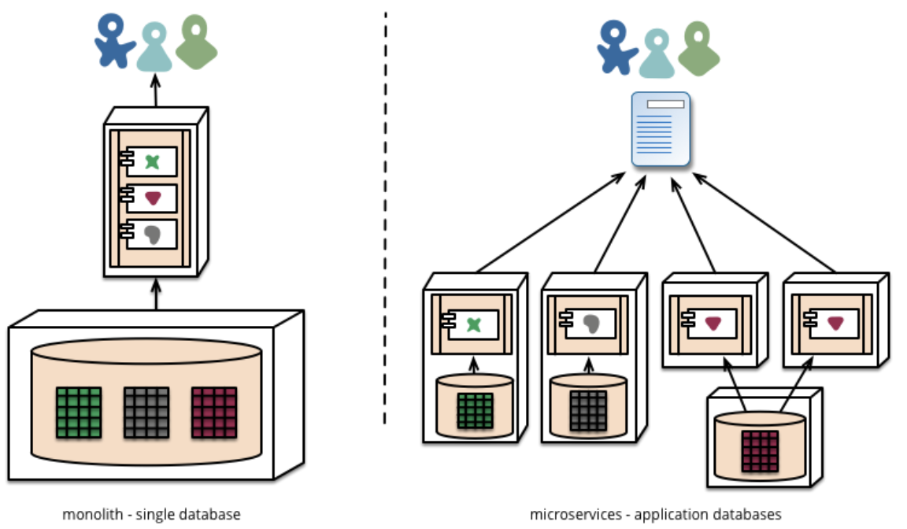

# Microservices
### These notes have been extracted from a Martin Fowler and James Lewis article (https://martinfowler.com/articles/microservices.html)

## A Definition of this new architectural term
The term "Microservice Architecture" has sprung up over the last few years to describe a particular way of designing applications as suites of indipendently deployable services. In other words, the microservice architectural style is an approach to developing a single application as a suite of small services, each running in its own process and communicating with lightweight mechanisms, often an HTTP resource API. There is a bare minimum of centralized management of these services, which may be written in different programming languages and use different data storage technologies.
## Monolith vs Microservices
To start explaining the microservice style it is useful to compare it to the monolithic style. Enterprise applications are often bult in three main parts: client-side, databases, server-side. We know that the server-side application will handle HTTP requests, execute domain logic, retrieve and update data from DB and select and populate views to be sent to the browser. This server-side application is a **Monolith** which is a single logical executable. **Any changes to the system involve building and deploying a new version of the server-side application**. You can horizontally scale the monolith by running many instances behind a **load balancer**. The **bad** comes when a change made to a samll part of the application, requires the entire monolith to be rebuilt and deployed. To wrap up: *a monolithic application puts all its functionalities into a single process and scales by replicating the monolith on multiple servers*. Here **microservices** comes: *a microservices architecture puts each element of funcionality into a separate service and scales by ditribuiting these services across servers, replicating as needed*.
 

**Monoliths**
## 
 

**Microservices**
## 
## **Characteristics of a Microservice Architecture**
### *Componentization via Services*
In software industry there's been a desire to build systems by plugging together components, but what is the component actually? 
 

**component**: *"unit of software that is independently replaceable and upgradeable"*;
 

Let's define other terms: 
 
**libraries**: *"components that are linked into a program and called using in-memory function calls"*;
 

 **services**: *"out-of-process components who communicate with a mechanism such as a web service request, or remote procedure call (RPC)"*;
  

 One main reason for using services as components rather than libraries is that services are independently deployable. If you have an application that consists of a multiple libraries in a single process, a change to any single component results in having to redeploy the entire application. But if that application is decomposed into multiple services, you can expect many single service changes to only require that service to be redeployed. That's not an absolute, some changes will change service interfaces resulting in some coordination, but the aim of a good microservice architecture is to minimize these through **cohesive** service boundaries and evolution mechanisms in the service contracts. Another consequence of using services as components is a more explicit component interace. Most languages do not have a good mechanism for defining an explicit **Published Interface** (*term that Martin Fowler used in his book "Refactoring" to refer to a class interface that's used outside the code base that it's defined in*). Often it's only documentation and discipline that prevents clients breaking a component's encapsulation, leading to overly-tight coupling between components. Services make it easier to avoid this by using explicit remote call mechanisms. But one more thing must be said: **using services like this does have downsides**. Remote calls are more expensive than in-process calls, and thus remote APIs need to be coarser-grained, which is often more awkward to use.
  

 ### *Organized around Business Capabilities*
 *"Any organization that deisgns a system will produce a design whose structure is a copy of the organization's communication structure. -- Melvin Consway, 1968"*
  

When looking to split a large application into parts, often management focuses on the tech stack, leading to UI teams, server-side logic teams and DB teams. When teams are separated along these lines, even simple changes can lead to a cross-team project taking time and budgetary approval.
 

The microservice approach to division is different, splitting up into services organized around business capability. Such services take a broad-stack implementation of software for that business area. Consequently the teams are cross-functional.
 

**How big is a microservice?**: The largest sizes reported follow Amazon's notion of the Two Pizza Team (i.e. the whole team can be fed by two pizzas), meaning no more than a dozen people.
 

### *Smart Endpoints and Dumb Pipes*
Applications built from microservices aim to be as decoupled and as cohesive as possible. They own their own domain logic and acto more as filters in the classical Unix sense - receiving a request, applying logic as appropriate and producing a response. These are choreographed using simple RESTish protocols rather than complex protocols such as WS-Choreography or orchestration by a central tool. The two protocols used most commonly are HTTP request-response with resource API's and lightweight messaging. The second approach in common use is messaging over a lightweight message bus. The infrastructure chosen is typically dumb (dumb as in acts as a message router only) - the smarts still live in the end points that are producing and consuming messages. The biggest issue in changing a monolith into microservices lies in changing the communication pattern.
 

### *Decentralized Governance*
One of the consequences of centralised governance is the tendency to standardise on single technology platforms. We prefer using the right tool for the job. Splitting the monolith's components out into services we have a choice when building each of them. You want to use Node.js to standup a simple reports page? Go for it. C++ for a particularly gnarly near-real-time component? Fine. You want to swap in a different flavour of database that better suits the read behaviour of one component? We have the technology to rebuild him. Of course, just because you can do something, doesn't mean you should - but partitioning your system in this way means you have the option. Perhaps the apogee of decentralised governance is the build it / run it ethos popularised by Amazon. Teams are responsible for all aspects of the software they build including operating the software 24/7. Devolution of this level of responsibility is definitely not the norm but we do see more and more companies pushing responsibility to the development teams. Netflix is another organisation that has adopted this ethos. Being woken up at 3am every night by your pager is certainly a powerful incentive to focus on quality when writing your code. These ideas are about as far away from the traditional centralized governance model as it is possible to be.
 

### *Decentralized Data Management*
While monolithic applications prefer a single logical database for persistant data, Microservices prefer letting each service manage its own database, either different instances of the same database technology, or entirely different database systems - an approach called Polyglot Persistence. You can use polyglot persistence in a monolith, but it appears more frequently with microservices.
 

 

The common approach to dealing with updates has been to use transactions to guarantee consistency when updating multiple resources. Using transactions like this helps with consistency, but imposes significant temporal coupling, which is problematic across multiple services. Distributed transactions are notoriously difficult to implement and as a consequence microservice architectures emphasize transactionless coordination between services.Choosing to manage inconsistencies in this way is a new challenge for many development teams, but it is one that often matches business practice. Often businesses handle a degree of inconsistency in order to respond quickly to demand, while having some kind of reversal process to deal with mistakes. The trade-off is worth it as long as the cost of fixing mistakes is less than the cost of lost business under greater consistency.