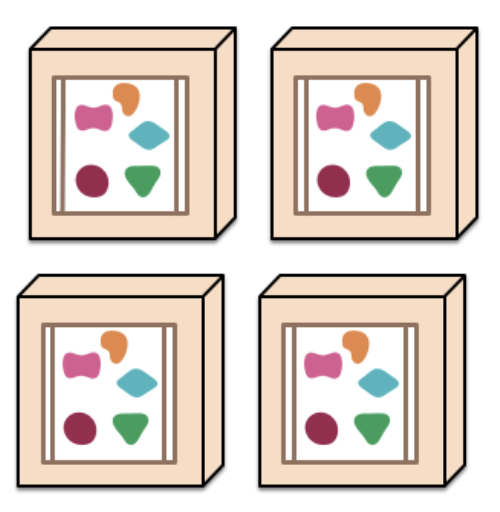
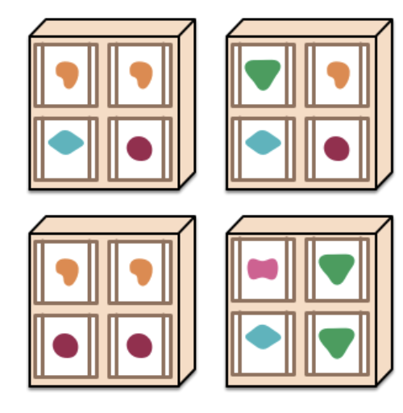

# Microservices
### These notes have been extracted from a Martin Fowler and James Lewis article (https://martinfowler.com/articles/microservices.html)

## A Definition of this new architectural term
The term "Microservice Architecture" has sprung up over the last few years to describe a particular way of designing applications as suites of indipendently deployable services. In other words, the microservice architectural style is an approach to developing a single application as a suite of small services, each running in its own process and communicating with lightweight mechanisms, often an HTTP resource API. There is a bare minimum of centralized management of these services, which may be written in different programming languages and use different data storage technologies.
## Monoloth vs Microservices
To start explaining the microservice style it is useful to compare it to the monolithic style. Enterprise applications are often bult in three main parts: client-side, databases, server-side. We know that the server-side application will handle HTTP requests, execute domain logic, retrieve and update data from DB and select and populate views to be sent to the browser. This server-side application is a **Monolith** which is a single logical executable. **Any changes to the system involve building and deploying a new version of the server-side application**. You can horizontally scale the monolith by running many instances behind a **load balancer**. The **bad** comes when a change made to a samll part of the application, requires the entire monolith to be rebuilt and deployed. To wrap up: *a monolithic application puts all its functionalities into a single process and scales by replicating the monolith on multiple servers*. Here **microservices** comes: *a microservices architecture puts each element of funcionality into a separate service and scales by ditribuiting these services across servers, replicating as needed*.
##
**Monoliths**
## 
##
**Microservices**
## 
## **Characteristics of a Microservice Architecture**
### *Componentization via Services*
In software industry there's been a desire to build systems by plugging together components, but what is the component actually? 
##
**component**: *"unit of software that is independently replaceable and upgradeable"*;
##
Let's define other terms: 
##
**libraries**: *"components that are linked into a program and called using in-memory function calls"*;
##
 **services**: *"out-of-process components who communicate with a mechanism such as a web service request, or remote procedure call (RPC)"*;
 ##
 One main reason for using services as components rather than libraries is that services are independently deployable. If you have an application that consists of a multiple libraries in a single process, a change to any single component results in having to redeploy the entire application. But if that application is decomposed into multiple services, you can expect many single service changes to only require that service to be redeployed. That's not an absolute, some changes will change service interfaces resulting in some coordination, but the aim of a good microservice architecture is to minimize these through **cohesive** service boundaries and evolution mechanisms in the service contracts. Another consequence of using services as components is a more explicit component interace. Most languages do not have a good mechanism for defining an explicit **Published Interface** (*term that Martin Fowler used in his book "Refactoring" to refer to a class interface that's used outside the code base that it's defined in*). Often it's only documentation and discipline that prevents clients breaking a component's encapsulation, leading to overly-tight coupling between components. Services make it easier to avoid this by using explicit remote call mechanisms. But one more thing must be said: **using services like this does have downsides**. Remote calls are more expensive than in-process calls, and thus remote APIs need to be coarser-grained, which is often more awkward to use